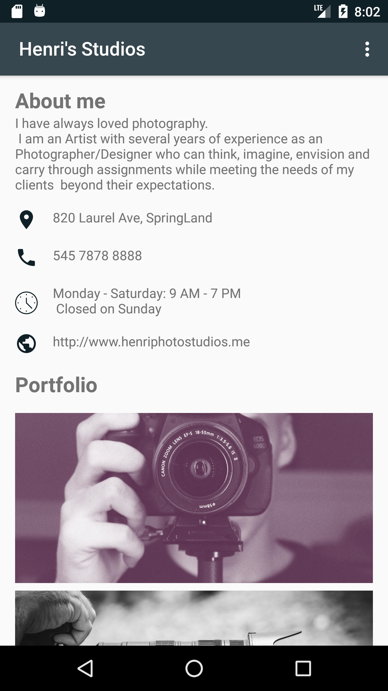

# My First App

This is a single page Android application for a business. The app displays information about the
business (description, contact, business hours, and some photo)

# Installation - Execution

1. To run the app, you need to have Android Studio installed.
2. Download this repo
3. Import the project into Android Studio and Run the app.

# Screenshot

